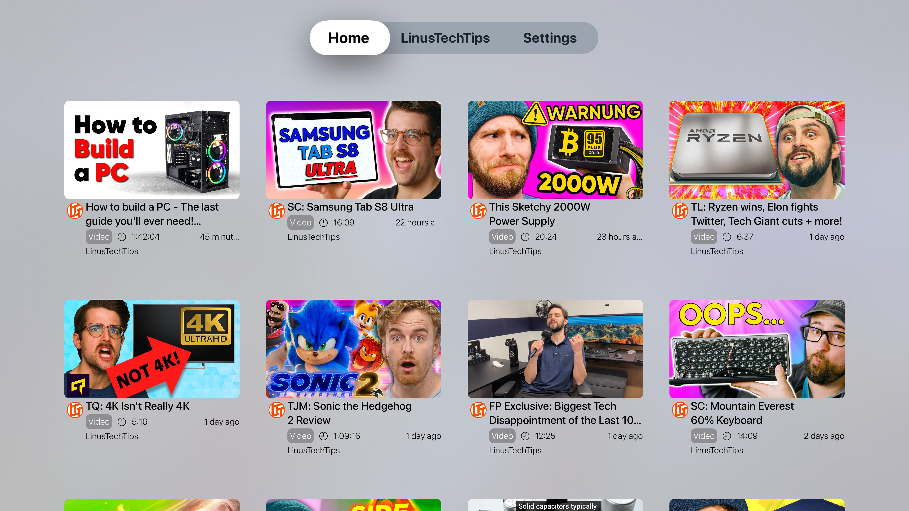

<h1 align="center">Wasserflug</h1>

[](https://apps.apple.com/us/app/wasserflug/id1611976921)

An unofficial [Floatplane](https://www.floatplane.com/) client for tvOS written in **Swift** using **SwiftUI**.

> [!WARNING]
> The App Store version is currently outdated. Using the [TestFlight](https://testflight.apple.com/join/aYwKPFNF) version is recommended.

> [!TIP]
> Check out [Hydravion](https://github.com/bmlzootown/Hydravion) for Roku and [Hydravion-AndroidTV](https://github.com/bmlzootown/Hydravion-AndroidTV) for Android TV

## Screenshots

<div align="center" display="flex">
  
  
  
</div>

## Features

- [x] Floatplane Login with two-factor authentication
  - [ ] Login via LTT Forum/Discord (See [FAQs](#frequently-asked-questions))
- [x] Aggregated home screen1
- [x] Creator screens with proper branding (banner image, profile picture, "About" information)
  - [x] Search a creator for videos
  - [x] Creator Livestream
  - [x] Channel support (branding, search, etc.)
- [x] Floatplane tags (view only)
- [x] Formatted post descriptions
- [x] 4K Support
- [x] Watch progress (syncs with Floatplane website)
- [x] Attachment views
  - [x] Videos
  - [x] Pictures
  - [ ] Audio
  - [ ] Gallery
- [ ] Livestream chat
- [ ] Notifications
- [ ] Creator discovery
- [ ] Picture-in-picture
- [ ] Buttons for searching by tags

> [!NOTE]
> You can manually search a tag by typing a `#` before the tag name

## Frequently Asked Questions

**Q: How do I log in using my LinusTechTips Forums or Discord account?**

A: If you normally log in to Floatplane using a Discord or LTT Forums account, a Floatplane account has automatically been created for you. The username for this account will be the same as the other service. The password was set when you logged in for the first time. If you forgot your password, you can use the [forgot password](https://www.floatplane.com/forgot-password) page to reset it.

**Q: How do I fix the following error when logging in: `Logging in was successful, but an error was encountered while loading your user profile`?**

A: This happens because of minor backend discrepancies between LTT and other content creators on Floatplane. Please contact the developer on Discord or by email to resolve this issue.

## Contributing

### TestFlight
If you are interested in beta testing Wasserflug, you can find it on [TestFlight](https://testflight.apple.com/join/aYwKPFNF).

### Building

1. Clone this repository
```shell
$ git clone https://github.com/jamamp/Wasserflug-tvOS
$ cd Wasserflug-tvOS
```
2. Open the `.xcodeproj` project file in Xcode
3. Click the `Signing & Capabilities` tab
4. Change `Team` to your account
5. Build and run the app

## Legal
- Created by James Linnell
- Logo from [Shutterstock](https://www.shutterstock.com/image-vector/small-seaplane-isolated-vector-illustration-single-1091024861) copyrighted by Yaroslav Shkuro
